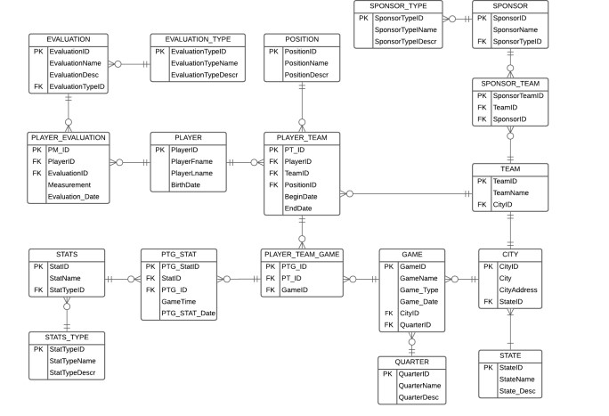

# nbadatabase
This project deploys a database that can hold information for Portland Trailblazers.

The image below constructs the ERD of the database.

The table defintions are contained in tabledefitions.sql.

Data to populate tables is contained in data.sql

Business Rules are contained in businessrules.sql

Computed Columns are contained in computedcolumns.sql

Created views for complex queries that could be used in tableau in views.sql

Created stored procedures to get values from tables and to set rows in tables
